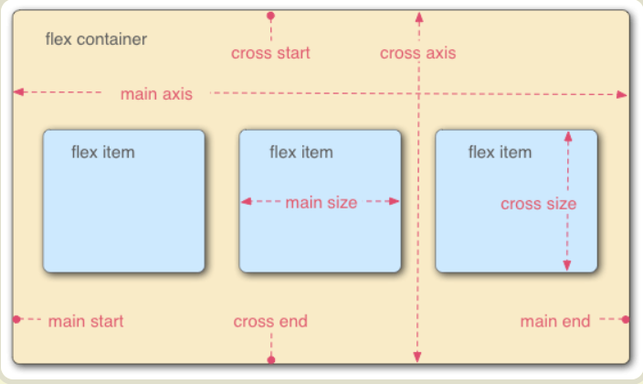

# Flex布局

## 概念

Flex 是 Flexible Box 的缩写，意为"弹性布局"，用来为盒状模型提供最大的灵活性。

任何一个容器都可以指定为 Flex 布局。

```csss
.box{
  display: flex;
}
```

行内元素也可以使用 Flex 布局。

```css
.box{
  display: inline-flex;
}
```

Webkit 内核的浏览器，必须加上`-webkit`前缀。

```css
.box{
  display: -webkit-flex; /* Safari */
  display: flex;
}
```

**采用Flex布局的元素，称为Flex容器**，**容器内部的盒子就成为`Flex`容器的成员**。



容器默认两根轴线，水平的主轴与垂直的交叉轴，主轴的开始位置叫做`main start`，结束位置叫做`main end`；交叉轴的开始位置叫做`cross start`，结束位置叫做`cross end`，容器成员默认按照主轴排列。

项目默认沿主轴排列。单个项目占据的主轴空间叫做`main size`，占据的交叉轴空间叫做`cross size`。

## 容器属性

### flex-direction

`flex-direction`属性决定主轴的方向（即项目的排列方向），取值为`row | row-reverse | column | column-reverse`。

* `row`默认值：主轴为水平方向，起点在左端。水平向右
* `row-reverse`：主轴为水平方向，起点在右端，容器成员顺序与`row`顺序相反。水平向左
* `column`：主轴为垂直方向，起点在上沿。垂直向下
* `column-reverse`：主轴为垂直方向，起点在下沿，容器成员顺序与`column`顺序相反。垂直向上

```html
<div id="t1">
    <div>1</div>
    <div>2</div>
    <div>3</div>
</div>
    <!-- 
        3
        2
        1
     -->
<style type="text/css">
    #t1{
        display: flex;
        flex-direction: column-reverse;
    }
</style>
```

### flex-wrap

默认情况下，项目都排在一条线（又称"轴线"）上。`flex-wrap`属性定义，如果一条轴线排不下，如何换行。

取值为`nowrap | wrap | wrap-reverse`。

* `nowrap`默认：不换行，当空间不足时，会按轴线方向成员大小比例缩小的成员。
* `wrap`：距离不够时换行，新起一行排列。
* `wrap-reverse`：距离不够时换行，新起的一行在上方。

```html
<div id="t2" style="width: 20px;">
    <div>4</div>
    <div>5</div>
    <div>6</div>
</div>
    <!-- 
        45
        6
     -->
<style type="text/css">
    #t2{
        display: flex;
        flex-wrap: wrap;
    }
</style>
```

### flex-flow

`flex-flow`属性是`flex-direction`和`flex-wrap`属性的简写形式，默认值为`row nowarp`

```html
<div id="t3" style="width: 20px;">
    <div>7</div>
    <div>8</div>
    <div>9</div>
</div>
    <!-- 
        87
         9
     -->
<style type="text/css">
    #t3{
        display: flex;
        flex-flow: row-reverse wrap;
    }
</style>
```

### justify-content

`justify-content`属性定义了项目在主轴上的对齐方式。==水平轴对齐方式==

- `flex-start`（默认值）：左对齐
- `flex-end`：右对齐
- `center`： 居中
- `space-between`：两端对齐，项目之间的间隔都相等。
- `space-around`：每个项目两侧的间隔相等。所以，项目之间的间隔比项目与边框的间隔大一倍。

```html
<div id="t4">
    <div>a</div>
    <div>b</div>
    <div>c</div>
</div>
<!-- abc[水平居中] -->
<style type="text/css">
    #t4{
        display: flex;
        justify-content: center;
    }
</style>
```

### align-items

`align-items`属性定义项目在交叉轴上如何对齐。==垂直轴对齐方式==

取值为`flex-start | flex-end | center | baseline | stretch`。

- `stretch`（默认值）：如果项目未设置高度或设为auto，将占满整个容器的高度。
- `flex-start`：交叉轴的起点对齐。
- `flex-end`：交叉轴的终点对齐。
- `center`：交叉轴的中点对齐。
- `baseline`: 项目的第一行文字的基线对齐。

```html
<div id="t5" style="height: 50px;">
    <div>d</div>
    <div>e</div>
    <div>f</div>
</div>
<!-- def[垂直居中] 水平穿过def中心-->  
<style type="text/css">
    #t5{
        display: flex;
        align-items: center;
    }
</style>
```

### align-content

`align-content`属性定义了多根轴线的对齐方式。如果项目只有一根轴线，该属性不起作用。

* `stretch`默认值：轴线占满整个交叉轴。
* `flex-start`：与交叉轴的起点对齐。
* `flex-end`：与交叉轴的终点对齐。
* `center`：与交叉轴的中点对齐。
* `space-between`：与交叉轴两端对齐，轴线之间的间隔平均分布。
* `space-around`：每根轴线两侧的间隔都相等。所以，轴线之间的间隔比轴线与边框的间隔大一倍。

```html
<div id="t6" style="height: 50px;width: 20px;">
    <div>g</div>
    <div>h</div>
    <div>i</div>
</div>
<!-- 
    g
    hi
    [交叉轴space-between] 
-->
<style type="text/css">
    #t6{
        display: flex;
        flex-wrap: wrap;
        align-content: space-between;
    }
</style>
```

## 成员属性

### order

`order`属性定义成员的排列顺序。数值越小，排列越靠前，默认为0，可以为负值。

```css
.item {
  order: <integer>;
}
```

```html
<div class="flexBox">
    <div style="order: 1;">j</div>
    <div style="order: 3;">k</div>
    <div style="order: -2;">l</div>
</div>
<!-- ljk -->
<style type="text/css">
    .flexBox{
        display: flex;
    }
</style>
```

### flex-grow

`flex-grow`属性定义成员的放大比例，默认为`0`，即如果存在剩余空间，也不放大。

将**多余的空间**按比例分配给各成员。

```css
.item {
  flex-grow: <number>; /* default 0 */
}
```

```html
<div class="flexBox" style="width: 150px;">
    <div style="flex-grow: 1; width: 10px;">m</div>
    <div style="flex-grow: 2; width: 10px;">o</div>
    <div style="flex-grow: 3; width: 10px;">n</div>
</div>
<!-- m分配20px n分配40px o分配60px   m-30px,n-50px,o-70px -->
<style type="text/css">
    .flexBox{
        display: flex;
    }
</style>
```

### flex-shrink

`flex-shrink`属性定义了成员的缩小比例，默认为`1`，即如果空间不足，该成员将缩小。

如果一个成员的`flex-shrink`属性为0，其他项目都为1，负值对该属性无效。

flex 元素仅在默认宽度之和大于容器的时候才会发生收缩，计算过程参考：https://blog.csdn.net/Web_J/article/details/106143753

```html
<div class="flexBox" style="width: 100px;">
    <div style="flex-shrink: 1;width: 100px;">p</div>
    <div style="flex-shrink: 2;width: 100px;">q</div>
    <div style="flex-shrink: 3;width: 100px;">r</div>
</div>
<!-- p q r -->
     
<style type="text/css">
    .flexBox{
        display: flex;
    }
</style>
```

### flex-basis

`flex-basis`属性定义了在分配多余空间之前，成员占据的主轴空间`main size`相当于设置宽度，浏览器根据这个属性，计算主轴是否有多余空间，它的默认值为`auto`，即成员的本来大小。

```html
<div class="flexBox">
    <div>s</div>
    <div style="flex-basis: 40px;">t</div>
    <div>u</div>
</div>
<!-- s t u -->

<style type="text/css">
    .flexBox{
        display: flex;
    }
</style>
```

### flex

`flex`属性是`flex-grow`, `flex-shrink`和`flex-basis`的简写，默认值`0 1 auto`。后两个属性可选。按比例分割

```html
<div class="flexBox">
    <div style="flex: 1;">v</div>
    <div style="flex: 1;">w</div>
    <div style="flex: 1;">x</div>
</div>
<!-- v w x -->

<style type="text/css">
    .flexBox{
        display: flex;
    }
</style>
```

### align-self

`align-self`属性允许单个成员有与其他成员不一样的对齐方式，可覆盖`align-items`属性。默认值为`auto`，表示继承父元素的`align-items`属性，如果没有父元素，则等同于`stretch`。

```html
<div class="flexBox" style="height: 50px;">
    <div>y</div>
    <div style="align-self: center;">z</div>
    <div>0</div>
</div>
<!-- y z 0 -->

<style type="text/css">
    .flexBox{
        display: flex;
    }
</style>
```

## 参考

>http://www.ruanyifeng.com/blog/2015/07/flex-grammar.html
>
>https://blog.csdn.net/Web_J/article/details/106143753