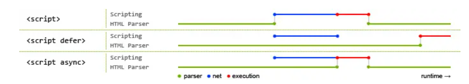

# defer和async作用和区别分析

## JS阻塞原理

浏览器内核可分为两部分：**渲染引擎**和**JS引擎**。早期渲染引擎和JS引擎并没有十分明确的区分，但随着JS引擎越来越独立，内核成为渲染引擎的代称。

渲染引擎包括：HTML解释器、CSS解释器、布局、网格、存储、图形、音视频、图片解码器等零部件。

`JS`引擎是独立于渲染引擎存在的。在文档中JS代码在哪插入就在哪执行。`JS`阻塞过程如下：

当HTML解释器遇到一个`script`标签时，它会暂停渲染过程，将控制权交给`JS`引擎。`JS`引擎对内联的JS代码直接执行，对外部JS代码需要先获取脚本再执行。等`JS`引擎执行完毕后，浏览器将控制权再交给渲染引擎，继续CSS和DOM的构建。因此与其说是 JS 把 CSS 和 HTML 阻塞了，不如说是 JS 引擎抢走了渲染引擎的控制权。

渲染引擎碰到js就交出大权是因为他不知道js的内容会不会对接下来的渲染有没有影响。但是我们引入js的时候是知道有没有影响的，可以根据具体情况用三种方式之一加载js。

## JS的三种加载方式

1、正常模式

```js
<script src="script.js"></script>
```

没有`defer`或`async`，浏览器会立即执行并加载执行脚本。阻塞后面文档元素的加载，直到脚本执行完毕。

2、defer模式

```js
<script defer src="index.js"></script> 
```

`script.js`会被异步加载，即加载和渲染后续文档元素的过程将和 script.js 的加载并行进行，但script脚本加载完并不会立即执行，而是等所有元素解析完毕之后，`DOMContentLoaded` 事件触发之前完成。因此它会按照写的顺序执行。

3、async模式

```js
<script async src="index.js"></script> 
```

script.js会被异步加载，即加载和渲染后续文档元素的过程将和 script.js 的加载并行进行（异步）。当 script.js加载完整立即执行script.js。执行script.js时，html解析暂停。

执行顺序和写的顺序无关，不保证执行顺序。

## 一图胜千言



绿色代表HTML解析，蓝色代表JS脚本网络加载时间，红色代表JS脚本执行时间。

## 适用场景

`async`适用于**不依赖其他脚本**且**不被其他脚本依赖**的独立模块。如：计数器或广告加载。

`defer`适用于HTML完成解析之后才能运行的JS脚本，依赖其他JS脚本或者被其他JS脚本依赖的脚本。如：包含多个脚本的页面。

## 可能的坑

**在现实当中，延迟脚本并不一定会按照顺序执行，也不一定会在 DOMContentLoaded 事件触发前执行，因此最好只包含一个延迟（异步）脚本。**

## 参考

>https://segmentfault.com/a/1190000017257370
>