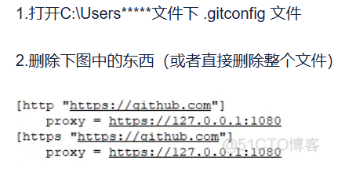

# Git错误集锦

## 1.Git报错：OpenSSL SSL_connect: SSL_ERROR_SYSCALL in connection to github.com:443

```shell
git config --global --list
查看以下配置
```

```shell
core.editor="D:\Microsoft VS Code\bin\code" --wait
user.name=hmisaka
user.email=1409640444@qq.com
credential.helper=manager
gui.recentrepo=D:/CODE/Web/web-learning
http.https://github.com.proxy=http://127.0.0.1:10809
```

使用http协议代理，window网络设置-->代理查看端口号为10209，解决

```shell 
git config --global http.https://github.com.proxy http://127.0.0.1:10809
```

## 2.RPC failed； HTTP 403 curl 22 The requested URL returned error: 403

### 原因1：

git密码设置永久记住，切换用户时，密码未切换为新用户密码。

解决方案：修改git配置文件git/config，将url中后添加用户名和@符


## 3.git: Failed to connect to 127.0.0.1 port 1080: Connection refused

解决方法1：


