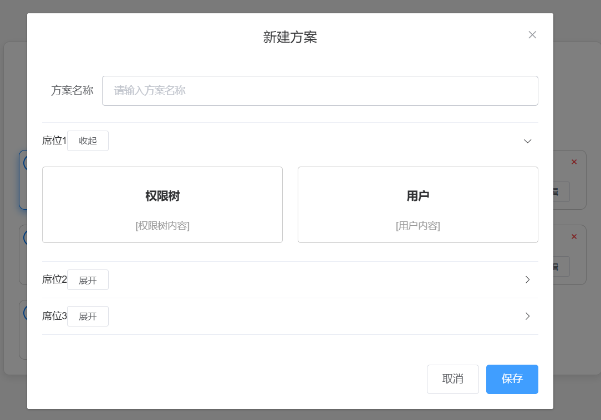

## 小地图

```vue
leaflet.vue
<template>
  <div class="leaflet">
    <div class="container">
      <div id="map" class="map"></div>
    </div>
  </div>
</template>

<script>
import L from "leaflet";
import "leaflet/dist/leaflet.css";

export default {
  name: "AMap",
  data() {
    return {
      map: null, // 地图实例
      marker: null, // 目标图标
      polyline: null, // 轨迹线
      coordinates: [
        [40.02404009136253, 116.50641060224784],
        [40.02504009136253, 116.50741060224784],
        [40.02604009136253, 116.50841060224784],
        [40.02704009136253, 116.50941060224784],
      ], // 模拟的目标移动路径
      currentIndex: 0, // 当前目标位置索引
    };
  },
  methods: {
    initMap() {
      // 初始化地图
      this.map = L.map("map", {
        center: [40.02404009136253, 116.50641060224784], // 地图中心
        zoom: 14, // 缩放比例
        zoomControl: true, // 启用缩放按钮
        doubleClickZoom: false, // 禁用双击放大
        attributionControl: false, // 移除右下角 Leaflet 标识
      });

      // 添加高德地图瓦片图层
      L.tileLayer(
        "http://webrd01.is.autonavi.com/appmaptile?lang=zh_cn&size=1&scale=1&style=7&x={x}&y={y}&z={z}"
      ).addTo(this.map);

      // 初始化目标图标
      const icon = L.icon({
        iconUrl: "https://cdn-icons-png.flaticon.com/512/684/684908.png", // 图标 URL
        iconSize: [32, 32], // 图标大小
        iconAnchor: [16, 16], // 图标锚点
      });

      this.marker = L.marker(this.coordinates[0], { icon }).addTo(this.map);

      // 初始化轨迹线
      this.polyline = L.polyline([], { color: "blue" }).addTo(this.map);

      // 开始模拟目标移动
      this.startSimulation();
    },
    startSimulation() {
      // 模拟目标移动
      const interval = setInterval(() => {
        if (this.currentIndex >= this.coordinates.length - 1) {
          clearInterval(interval); // 停止模拟
          return;
        }

        this.currentIndex++;
        const nextPosition = this.coordinates[this.currentIndex];

        // 更新图标位置
        this.marker.setLatLng(nextPosition);

        // 更新轨迹线
        this.polyline.addLatLng(nextPosition);

        // 平移地图到目标位置
        this.map.panTo(nextPosition);
      }, 1000); // 每秒更新一次
    },
  },
  mounted() {
    this.initMap();
  },
};
</script>

<style scoped>
.leaflet {
  position: relative;
  width: 100%;
  height: 100%;
}
.container {
  padding: 0px;
  width: 100%;
  height: 100%;
}
.map {
  width: 100%;
  height: calc(100%);
  z-index: 1;
}
</style>
```


## 方案管理

```vue
<template>
    <div class="container">
      <div class="plan-manager">
        <!-- 顶部标题和按钮 -->
        <div class="header">
          <h1>方案管理</h1>
          <el-button type="primary" @click="openDialog">新建方案</el-button>
        </div>
  
        <!-- 方案列表 -->
        <div class="plan-list">
          <div
            v-for="plan in plans"
            :key="plan.id"
            class="plan-card"
            :class="{ selected: selectedPlan === plan.id }"
          >
            <!-- 删除按钮 -->
            <button class="delete-btn" @click.stop="deletePlan(plan.id)">×</button>
  
            <!-- 左上角单选按钮 -->
            <div class="radio">
              <input
                type="radio"
                :checked="selectedPlan === plan.id"
                :id="'plan-' + plan.id"
                name="plan"
                @change="selectPlan(plan.id)"
              />
              <label :for="'plan-' + plan.id"></label>
            </div>
  
            <!-- 中间内容 -->
            <div class="plan-title">{{ plan.name }}</div>
            <div class="actions">
              <el-button size="mini" @click.stop="viewPlan(plan.id)">查看</el-button>
              <el-button size="mini" @click.stop="editPlan(plan.id)">编辑</el-button>
            </div>
          </div>
        </div>
      </div>
  
      <!-- 新建方案对话框 -->
      <el-dialog title="新建方案" :visible.sync="dialogVisible" width="50%">
        <div>
          <el-form :model="newPlan" label-width="80px">
            <el-form-item label="方案名称">
              <el-input v-model="newPlan.name" placeholder="请输入方案名称"></el-input>
            </el-form-item>
          </el-form>
          <div class="seats">
            <el-collapse v-model="activeSeats">
              <el-collapse-item
                v-for="seat in newPlan.seats"
                :key="seat.id"
                :name="seat.id"
              >
                <template #title>
                  {{ seat.name }}
                  <el-button size="mini" @click.stop="toggleSeat(seat.id)">
                    {{ activeSeats.includes(seat.id) ? "收起" : "展开" }}
                  </el-button>
                </template>
                <div class="seat-content">
                  <div class="tree">
                    <h3>权限树</h3>
                    <div class="tree-placeholder">[权限树内容]</div>
                  </div>
                  <div class="users">
                    <h3>用户</h3>
                    <div class="users-placeholder">[用户内容]</div>
                  </div>
                </div>
              </el-collapse-item>
            </el-collapse>
          </div>
        </div>
        <span slot="footer" class="dialog-footer">
          <el-button @click="dialogVisible = false">取消</el-button>
          <el-button type="primary" @click="savePlan">保存</el-button>
        </span>
      </el-dialog>
    </div>
  </template>
  
  <script>
  export default {
    name: "PlanManager",
    data() {
      return {
        plans: [
          { id: 1, name: "方案1" },
          { id: 2, name: "方案2" },
          { id: 3, name: "方案3" },
          { id: 4, name: "方案4" },
          { id: 5, name: "方案5" },
          { id: 6, name: "方案6" },
          { id: 7, name: "方案7" },
          { id: 8, name: "方案8" },
          { id: 9, name: "方案9" },
          { id: 10, name: "方案10" },
        ],
        selectedPlan: null, // 当前选中的方案 ID
        dialogVisible: false, // 控制对话框显示
        newPlan: {
          name: "",
          seats: [
            { id: 1, name: "席位1" },
            { id: 2, name: "席位2" },
            { id: 3, name: "席位3" },
          ],
        },
        activeSeats: [], // 当前展开的席位
      };
    },
    methods: {
      openDialog() {
        this.dialogVisible = true;
        this.newPlan.name = ""; // 清空方案名称
      },
      selectPlan(planId) {
        this.selectedPlan = planId; // 设置选中的方案
      },
      viewPlan(planId) {
        this.$message.info(`查看方案：${planId}`);
      },
      editPlan(planId) {
        const plan = this.plans.find((p) => p.id === planId);
        const newName = prompt("请输入新的方案名称：", plan.name);
        if (newName) {
          plan.name = newName; // 更新方案名称
        }
      },
      deletePlan(planId) {
        if (confirm("确定要删除该方案吗？")) {
          this.plans = this.plans.filter((p) => p.id !== planId); // 删除方案
          if (this.selectedPlan === planId) {
            this.selectedPlan = null; // 如果删除的是选中的方案，清空选中状态
          }
        }
      },
      toggleSeat(seatId) {
        const index = this.activeSeats.indexOf(seatId);
        if (index > -1) {
          this.activeSeats.splice(index, 1); // 收起
        } else {
          this.activeSeats.push(seatId); // 展开
        }
      },
      savePlan() {
        if (!this.newPlan.name) {
          this.$message.error("方案名称不能为空！");
          return;
        }
        const newId = this.plans.length + 1;
        this.plans.push({ id: newId, name: this.newPlan.name });
        this.dialogVisible = false; // 关闭对话框
        this.$message.success("方案保存成功！");
      },
    },
  };
  </script>
  
  <style scoped>
  /* 外层容器样式 */
  .container {
    display: flex;
    justify-content: center;
    align-items: center;
    width: 100vw;
    height: 100vh;
    box-sizing: border-box;
    background-color: #f5f5f5; /* 背景颜色 */
  }
  
  /* 内部内容样式 */
  .plan-manager {
    display: flex;
    flex-direction: column;
    padding: 20px;
    box-sizing: border-box;
    width: 80%;
    max-width: 800px;
    background-color: white;
    border: 1px solid #ddd;
    border-radius: 8px;
    box-shadow: 0 4px 10px rgba(0, 0, 0, 0.1);
  }
  
  /* 方案列表样式 */
  .plan-list {
    display: grid;
    grid-template-columns: repeat(auto-fill, minmax(150px, 1fr));
    gap: 20px;
  }
  
  .plan-card {
    display: flex;
    flex-direction: column;
    justify-content: space-between;
    align-items: center;
    padding: 10px;
    border: 1px solid #ccc;
    border-radius: 8px;
    background-color: white;
    cursor: pointer;
    transition: box-shadow 0.3s ease, transform 0.2s ease;
    position: relative;
  }
  
  .plan-card:hover {
    box-shadow: 0 4px 10px rgba(0, 0, 0, 0.2);
    transform: translateY(-5px);
  }
  
  .plan-card.selected {
    border-color: #007bff;
    box-shadow: 0 4px 10px rgba(0, 123, 255, 0.5);
  }
  
  .plan-title {
    font-size: 16px;
    font-weight: bold;
    margin-bottom: 10px;
  }
  
  /* 删除按钮样式 */
  .delete-btn {
    position: absolute;
    top: 5px;
    right: 5px;
    background: none;
    border: none;
    color: #ff4d4f;
    font-size: 16px;
    cursor: pointer;
  }
  
  .delete-btn:hover {
    color: #d9363e;
  }
  
  /* 单选按钮样式 */
  .radio {
    position: absolute;
    top: 5px;
    left: 5px;
  }
  
  .radio input {
    display: none;
  }
  
  .radio label {
    width: 20px;
    height: 20px;
    border: 2px solid #007bff;
    border-radius: 50%;
    display: inline-block;
    position: relative;
    cursor: pointer;
  }
  
  .radio input:checked + label::after {
    content: "";
    width: 12px;
    height: 12px;
    background-color: #007bff;
    border-radius: 50%;
    position: absolute;
    top: 50%;
    left: 50%;
    transform: translate(-50%, -50%);
  }
  
  /* 操作按钮样式 */
  .actions {
    display: flex;
    gap: 10px;
  }
  
  /* 对话框内容样式 */
  .seats {
    margin-top: 20px;
  }
  
  .seat-content {
    display: flex;
    gap: 20px;
    margin-top: 10px;
  }
  
  .tree,
  .users {
    flex: 1;
    border: 1px solid #ccc;
    border-radius: 4px;
    padding: 10px;
  }
  
  .tree-placeholder,
  .users-placeholder {
    text-align: center;
    color: #999;
  }
  </style>
```


